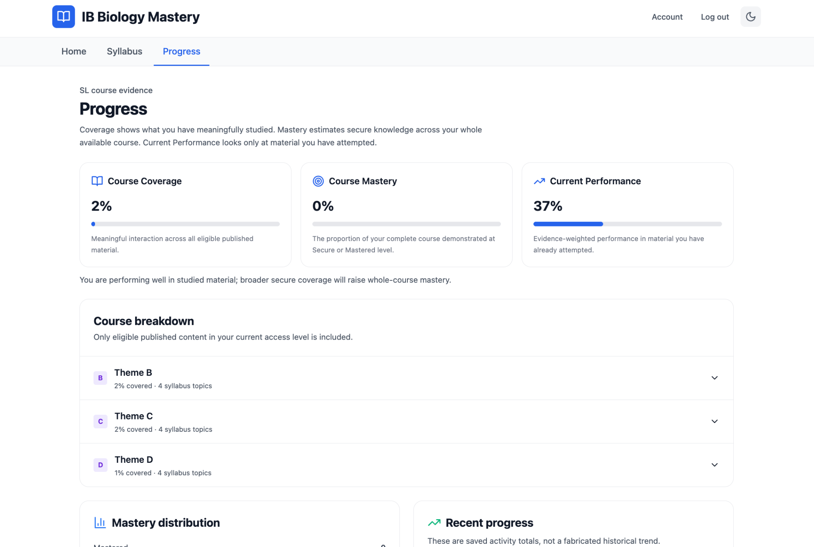
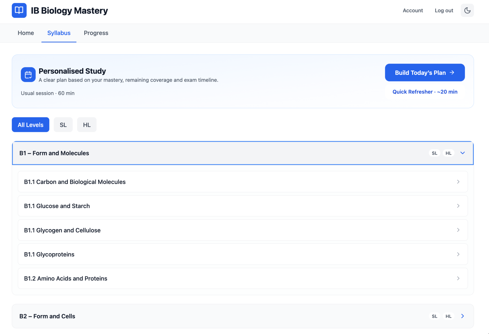
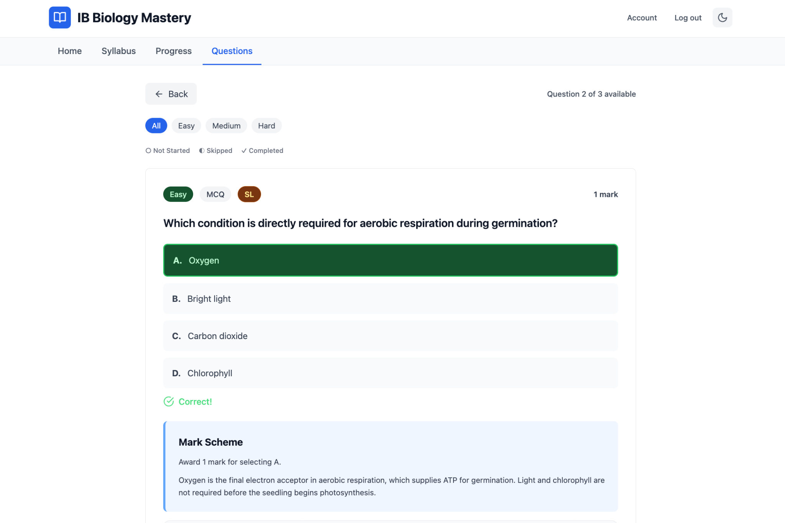
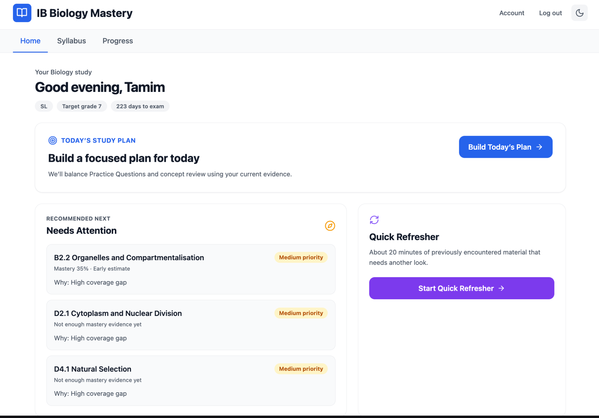

# IB Biology Mastery

**A practice-first learning platform built specifically for IB Biology.**

IB Biology Mastery helps students decide what to study, practise with syllabus-aligned questions, track their mastery across the course, and focus their revision time where it matters most.

Built around the current IB Biology specification.

> **Status:** Active development — preparing for student and teacher testing.

---

## The Problem

IB Biology students have access to large amounts of revision content, but having more content does not necessarily answer the most important question:

**What should I study next?**

Students often move between notes, question banks and past papers without a clear picture of their actual coverage or mastery of the syllabus.

IB Biology Mastery is designed around a different approach: use practice to build evidence of what a student knows, identify what needs attention, and turn that evidence into a focused study plan.

## The Product

The platform combines four core components:

- **Exam-style practice** — questions organised around the IB Biology syllabus, difficulty and assessment style.
- **Mastery tracking** — performance is converted into evidence of understanding across individual syllabus areas.
- **Coverage tracking** — students can distinguish between material they have encountered and material they can actually answer securely.
- **Personalised study planning** — the platform uses the student's current evidence, remaining syllabus coverage and exam timeline to prioritise what they should work on next.

The aim is to move from:

**content → practice → evidence → targeted revision**

rather than simply giving students another library of revision material.

---

## Structured Around the IB Biology Syllabus

The product is built specifically around the current IB Biology curriculum rather than adapting a generic learning system to Biology.

Students can navigate the course by syllabus area, distinguish SL and HL content, and practise at the level of individual topics.

This syllabus structure also forms the basis of the mastery system: performance can be connected back to the specific areas of Biology that require more work.

---

## Practice-First Learning

Questions are the core learning interaction.

The question system supports different question types, difficulty levels, mark allocations and IB-style command terms. After answering, students receive immediate feedback and a mark-scheme-based explanation.

A major focus of development is ensuring that questions are not merely scientifically correct, but are appropriate to the **scope, depth and assessment style of IB Biology**.

The question-generation and review standard is being calibrated against current-specification IB Biology examination material, including:

- syllabus boundaries
- command terms
- expected response depth
- mark allocation
- recall versus application
- SL and HL scope
- mark-scheme structure

The objective is to build a large practice bank while maintaining genuine exam relevance.

---

## From Performance to Mastery

IB Biology Mastery separates three ideas that are often treated as the same thing:

**Coverage** — how much of the available course a student has meaningfully studied.

**Mastery** — how much of the complete course they have demonstrated secure knowledge of.

**Current performance** — how well they are performing on the material they have actually attempted.

This allows the platform to distinguish between, for example, a student performing strongly on a small part of the syllabus and a student who has demonstrated secure understanding across the whole course.

That evidence feeds back into recommendations and future study sessions.

## Personalised Study Planning

The long-term product goal is not simply to answer:

> "How am I doing?"

but:

> **"Given what I know now, what should I do next?"**

The study-planning system uses the student's existing mastery evidence, gaps in syllabus coverage and remaining time before their examination to prioritise revision.

Students can then generate a focused study session or use a shorter refresher session for previously encountered material.

## Current Development

IB Biology Mastery is currently under active development ahead of initial student and teacher testing.

Current priorities include:

- expanding and auditing the question bank
- calibrating question quality against current IB assessment material
- improving mastery and recommendation logic
- refining personalised study planning
- completing syllabus coverage
- improving onboarding and the student experience
- testing the product with real IB Biology users

## Why I Built It

I recently completed the IB Diploma and studied Biology at Higher Level.

While preparing for the IB, I saw that students already had access to substantial amounts of revision material. The harder problem was deciding **where limited revision time should actually be spent** and knowing whether studying a topic had translated into the ability to answer examination questions.

I started building IB Biology Mastery to explore whether practice data could be used to make that decision systematically.

The project has since developed into a working web application combining syllabus-based practice, progress tracking, mastery estimation and personalised study planning.

## Development

IB Biology Mastery is an independently developed web application.

The production source code, question bank and internal content systems are maintained in a private repository. This repository serves as a public product showcase.

---

**IB Biology Mastery — Know what to learn. Practise what matters.**
